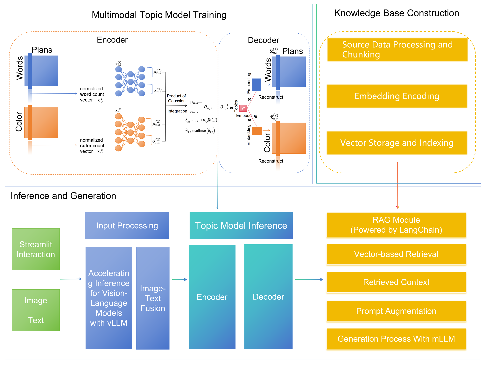

# ColorRAG

## 🎨 项目简介

ColorRAG 是一个基于多模态主题模型的智能配色方案生成系统。该项目结合了文本描述、颜色数据和人工审美评分，通过创新的主题建模方法，实现了从文本描述到高质量配色方案的智能生成。

## ✨ 核心特性

- **🎯 审美指导**：集成人工审美评分，确保生成的配色方案符合人类审美标准
- **🔄 多模态融合**：同时处理文本描述和RGB颜色数据，实现跨模态理解
- **🧠 主题建模**：基于moETM框架，学习"色彩-文本"联合分布的主题表示
- **🎨 智能生成**：支持从文本描述生成配色方案，或从颜色生成文本描述
- **🔍 相似检索**：基于主题空间的相似性搜索，快速找到最匹配的配色方案
- **🌐 Web界面**：提供友好的Gradio Web界面，支持实时交互

## 🏗️ 技术架构

### 核心模型
- **多模态主题模型**：基于moETM (multi-omics Embedded Topic Model)
- **编码器-解码器架构**：双塔结构处理文本和颜色模态
- **专家乘积融合**：Product of Gaussians (PoG) 技术融合多模态信息
- **VAE正则化**：确保潜在空间的规整性和生成能力

### 技术栈
- **深度学习**：PyTorch + 神经网络
- **自然语言处理**：TF-IDF向量化 + 词袋模型
- **Web框架**：Gradio + 实时交互界面
- **数据处理**：Pandas + NumPy + Scikit-learn

## 📁 项目结构

```
AETM/
├── data/                    # 数据文件
│   ├── palettes_descriptions.xlsx    # 配色方案描述数据
│   └── generate_text_labels.py      # 文本标签生成脚本
├── src/                     # 源代码
│   ├── topic_model.py              # 主题模型定义
│   ├── color_generator_app.py      # 主应用（Web界面）
│   ├── train_complete.py           # 完整训练脚本
│   ├── train_simple.py             # 简化训练脚本
│   ├── train_with_separate_encoders.py  # 分离编码器训练
│   └── eval_utils.py               # 评估工具
├── models/                  # 训练好的模型
├── outputs/                 # 生成结果和评估输出
├── matrices/                # 中间矩阵数据
├── requirements_training.txt # 依赖包列表
├── start_server.sh          # Linux/Mac启动脚本
├── start_server.bat         # Windows启动脚本
├── deploy_config.py         # 部署配置
├── Dockerfile               # Docker配置
└── DEPLOYMENT_GUIDE.md      # 部署指南
```

## 🚀 快速开始

### 环境要求
- Python 3.8+
- 至少4GB内存
- 2GB可用磁盘空间

### 安装步骤

1. **克隆项目**
```bash
git clone https://github.com/1662859379/AETM.git
cd AETM
```

2. **创建虚拟环境**
```bash
python -m venv venv
source venv/bin/activate  # Linux/Mac
# 或 venv\Scripts\activate  # Windows
```

3. **安装依赖**
```bash
pip install -r requirements_training.txt
```

4. **启动应用**
```bash
# 使用启动脚本
./start_server.sh  # Linux/Mac
# 或 start_server.bat  # Windows

# 或直接启动
python src/color_generator_app.py
```

5. **访问Web界面**
打开浏览器访问：`http://localhost:7860`

## 🎯 使用指南

### 文本到配色方案生成
1. 在文本输入框中描述你想要的配色风格
2. 例如："我想要一个宁静、夏日海滩感觉的配色方案"
3. 点击生成按钮
4. 系统会返回5个RGB颜色值和相应的描述

### 配色方案检索
1. 输入描述文本
2. 系统会在10000+配色方案库中搜索最匹配的方案
3. 基于主题相似性和颜色相似性进行排序
4. 返回最佳匹配的配色方案

### 模型训练
```bash
# 完整训练
python src/train_complete.py

# 简化训练
python src/train_simple.py

# 分离编码器训练
python src/train_with_separate_encoders.py
```

## 🔬 技术原理

### 多模态主题建模
AETM基于moETM框架，将文本描述和RGB颜色数据映射到统一的主题空间：

1. **编码阶段**：
   - 文本塔：处理文本描述 → 主题分布
   - 颜色塔：处理RGB颜色 → 主题分布
   - 专家乘积：融合两个模态的主题分布

2. **解码阶段**：
   - 从主题分布重构文本和颜色表示
   - 生成符合审美标准的配色方案

3. **审美指导**：
   - 集成人工评分作为监督信号
   - 确保生成结果符合人类审美标准

### 损失函数
```
L_total = w1 * L_reconstruction + w2 * L_kl + w3 * L_score
```
- **重构损失**：确保生成质量
- **KL散度损失**：正则化潜在空间
- **评分损失**：审美指导

## 📊 性能指标

- **主题数量**：100个主题
- **嵌入维度**：32维
- **数据规模**：10,743个配色方案
- **模态融合**：文本 + RGB颜色 + 审美评分
- **生成质量**：基于人工评分验证

## 🔧 配置选项

### 环境配置
```bash
# 开发环境
export FLASK_ENV=development

# 生产环境
export FLASK_ENV=production

# 测试环境
export FLASK_ENV=test
```

### 模型参数
- `NUM_TOPICS`: 主题数量 (默认: 100)
- `EMBEDDING_DIM`: 嵌入维度 (默认: 32)
- `LEARNING_RATE`: 学习率 (默认: 0.001)
- `BATCH_SIZE`: 批次大小 (默认: 32)
- `EPOCHS`: 训练轮数 (默认: 100)

## 🚀 部署方案

### 本地部署
```bash
./start_server.sh  # Linux/Mac
start_server.bat   # Windows
```

### 服务器部署
```bash
# 使用Docker
docker build -t aetm .
docker run -d -p 7860:7860 --name aetm-app aetm

# 或直接部署
git clone https://github.com/1662859379/AETM.git
cd AETM
python -m venv venv
source venv/bin/activate
pip install -r requirements_training.txt
python src/color_generator_app.py
```

详细部署指南请参考 [DEPLOYMENT_GUIDE.md](DEPLOYMENT_GUIDE.md)

## 🤝 贡献指南

欢迎贡献代码！请遵循以下步骤：

1. Fork 项目
2. 创建功能分支 (`git checkout -b feature/AmazingFeature`)
3. 提交更改 (`git commit -m 'Add some AmazingFeature'`)
4. 推送到分支 (`git push origin feature/AmazingFeature`)
5. 打开 Pull Request

## 📄 许可证

本项目采用 MIT 许可证 - 查看 [LICENSE](LICENSE) 文件了解详情

## 📞 联系方式

- 项目主页：https://github.com/1662859379/AETM
- 问题反馈：https://github.com/1662859379/AETM/issues
- 邮箱：1662859379@qq.com

## 🙏 致谢

- 感谢moETM论文作者提供的理论基础
- 感谢所有贡献者的辛勤工作
- 感谢开源社区的支持

---

**AETM** - 让AI理解人类审美，创造美好色彩世界 🎨 
